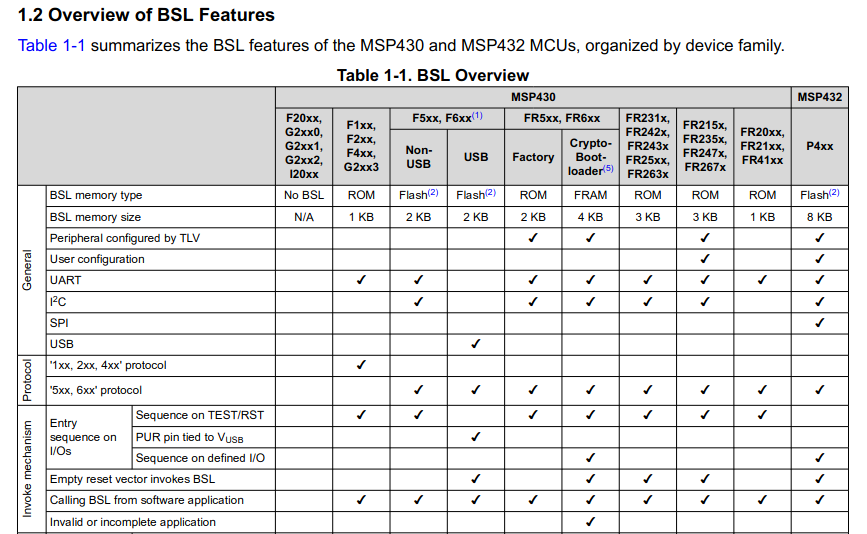

# MSP430G2553 Custom BSL

Complete example with step-by-step instructions on how to develop a custom BSL solution for the MSP430G2553 MCU.

The MSP430G2553 is an MCU from TI MSP430 family

The idea is to develop a custom boot sequence to allow:

1. Boot into a custom BSL

2. Perform a validity test of the application data

3. Boot into application data

4. Allow an upgrade of an application data

Even if it may not seem a complex project, it takes quite a number of steps. For simplicity and comprehension, the process will be split into simpler goals.

The existing documentation from TI is so abundant that is easy to get lost.

## Disclaimer

THIS GUIDE AND THE SOFTWARE THAT ACCOMPANIES IT IS PROVIDED "AS IS", WITHOUT WARRANTY OF ANY KIND, EXPRESS OR IMPLIED, INCLUDING BUT NOT LIMITED TO THE WARRANTIES OF MERCHANTABILITY, FITNESS FOR A PARTICULAR PURPOSE AND NON INFRINGEMENT. IN NO EVENT SHALL THE AUTHORS OR COPYRIGHT HOLDERS BE LIABLE FOR ANY CLAIM, DAMAGES OR OTHER LIABILITY, WHETHER IN AN ACTION OF CONTRACT, TORT OR OTHERWISE, ARISING FROM, OUT OF OR IN CONNECTION WITH THE SOFTWARE OR THE USE OR OTHER DEALINGS IN THE SOFTWARE.

## Background

The TI supplied BSL resides in ROM and cannot be overridden. See capture from document slau319ae

The fact the MSP430G2xx3 uses ROM BSL has some major implication:

1. Any custom BSL code will reside in the normal application memory.

2. All BSL development is safe, as there always will be the ROM BSL to revert to in case of major problems.

3. The Flash memory for Application data has to be shared between the custom BSL and the real Application.

4. Unless we are careful with the linker commands we can easily erase the custom BSL code.
   
   

## Required tools

This is the list of SW and HW components used to develop and run this example is:

Software

- CCS (CodeComposerStudio) 11.  Although older or newer versions should work

- Serial communications SW

Hardware

- MSP-EXP430G2ET

- FTDI  UART TTL to USB cable

- Some basic wiring

# Development

Development has been split in two parts, each part having 3 different smaller steps

## [Part 1](doc/part1.md)

## [Part 2](doc/part2.md)

# References

MSP430G2x53, MSP430G2x13 Mixed Signal Microcontroller datasheet (Rev. J)(SLAS735)

MSP430x2xx Family User's Guide (SLAU144)

MSP430 Programming Via the Bootstrap Loader User's Guide (SLAU319).
